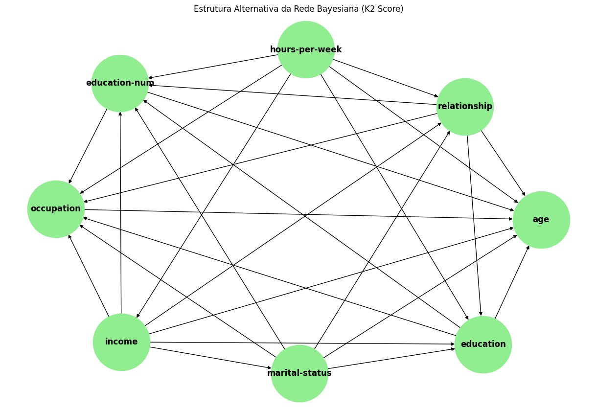
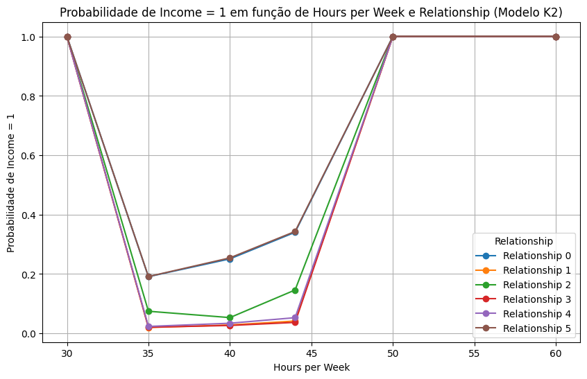

<h1 align="center"> Predição de Renda Anual com Redes Bayesianas </h1>

## Sumário

* [Descrição](#descrição)
* [Requisitos](#requisitos)
* [Ferramentas](#ferramentas)
* [Dificuldades](#dificuldades)
* [Resultados](#resultados)
* [Conclusão](#conclusao)

## Descrição

Este trabalho consiste na criação de uma Rede Bayesiana utilizando o conjunto de dados Adult Income Dataset para prever se um indivíduo ganha mais de 50.000 dólares por ano. O projeto incluirá exploração de dados, treinamento do modelo e avaliação de desempenho, com um relatório detalhando os resultados e as implicações.

## Requisitos

- [x] Coleta de Dados: Importar o conjunto de dados Adult Income Dataset para análise.
- [x] Exploração e Pré-processamento: 
  - Realizar uma análise exploratória dos dados (EDA).
  - Tratar valores ausentes e inconsistentes.
  - Codificar variáveis categóricas em formato numérico.
- [x] Definição da Estrutura da Rede: 
  - Identificar e definir as variáveis relevantes para a rede.
  - Estruturar a rede de acordo com as relações de dependência entre as variáveis.
- [x] Treinamento do Modelo: Implementar a Rede Bayesiana e realizar o treinamento utilizando os dados pré-processados.
- [x] Ajuste de Hiperparâmetros: Experimentar diferentes configurações e ajustar hiperparâmetros para otimizar o desempenho do modelo.
- [x] Avaliação do Modelo: Avaliar o modelo utilizando métricas apropriadas, como precisão, recall, F1-score e matriz de confusão.
- [x] Geração de Relatório: Documentar todas as etapas do projeto, incluindo a análise dos resultados e discussões sobre as implicações dos achados.

## Ferramentas

- **Python**: Uma linguagem de programação de alto nível, versátil e de fácil leitura, amplamente utilizada para desenvolvimento web, análise de dados, inteligência artificial e automação.
- **Overleaf**: Uma plataforma colaborativa baseada em nuvem para edição de documentos em LaTeX, que permite aos usuários criar, compartilhar e publicar trabalhos acadêmicos de forma eficiente.
- **pandas**: Biblioteca que oferece estruturas de dados eficientes, como DataFrames, para manipulação e análise de dados em Python.
- **numpy**: Biblioteca para computação numérica, que fornece suporte para arrays multidimensionais e funções matemáticas de alto desempenho.
- **matplotlib**: Ferramenta de visualização para criar gráficos e plots estáticos, interativos e animados em Python.
- **seaborn**: Biblioteca de visualização de dados que simplifica a criação de gráficos estatísticos e é baseada no matplotlib, proporcionando uma estética mais estilizada.
- **sklearn**: Biblioteca de aprendizado de máquina que inclui ferramentas para classificação, regressão, clustering e avaliação de modelos.
- **pgmpy**: Biblioteca para modelagem de redes probabilísticas, incluindo Redes Bayesianas, com suporte para inferência e aprendizado.
- **networkx**: Biblioteca para a criação, manipulação e estudo da estrutura, dinâmica e funções de grafos e redes.
- **ucimlrepo**: Ferramenta para acessar datasets do repositório UCI Machine Learning, facilitando o download e a manipulação de conjuntos de dados.

## Dificuldades

Desenvolver o algoritmos para cada etapa do trabalho, problemas de excesso de uso de memoria RAM.

## Resultados

Após o pré-processamento, observamos, com base na análise visual do histograma da Informação Mútua (veja o histograma abaixo), que foram identificadas variáveis que aparentam ter uma influência significativa sobre a variável alvo "renda". Dentre elas, destaca-se "horas trabalhadas por semana", que geralmente possui uma correlação com o nível de renda; "relacionamento", que se refere ao tipo de vínculo pessoal e pode afetar a estabilidade financeira; e "estado civil", que influencia o perfil econômico. As variáveis "educação" e "ocupação" também foram observadas como fatores relevantes, já que o nível de escolaridade e o tipo de emprego estão frequentemente associados à capacidade de ganho. Além disso, "sexo" e "idade" apresentaram padrões de separação entre as classes de "renda", sugerindo que essas variáveis também podem contribuir para a construção de um modelo preditivo robusto.

 

 

A estrutura da rede Bayesiana foi elaborada com o objetivo de capturar as relações de dependência entre as variáveis mais relevantes do conjunto de dados, utilizando duas abordagens distintas: o BIC Score e o K2 Score. A primeira estrutura, obtida com o BIC Score, é mais seletiva, conectando apenas as variáveis com dependências diretas mais significativas, resultando em uma rede menos densa e mais interpretável. Já a segunda estrutura, construída com o K2 Score, apresenta uma rede Bayesiana mais densa e complexa, onde praticamente todas as variáveis estão interligadas, permitindo capturar relações mais sutis entre as variáveis. Essa diferença ocorre porque o K2 Score é um critério que favorece redes mais complexas, sem penalizar tanto a inclusão de conexões adicionais como faz o BIC Score. Essas duas estruturas permitem comparar a simplicidade e a complexidade na modelagem das dependências probabilísticas, possibilitando uma análise mais completa da influência das variáveis sobre o modelo.

 

 

Com base nessa seleção, realizamos ajustes metodológicos adicionais para garantir a precisão e a interpretabilidade do modelo. Para o ajuste dos hiperparâmetros, utilizamos técnicas de otimização iterativa, visando balancear a complexidade do modelo e evitar o overfitting. Aplicamos também estratégias de treinamento com validação cruzada para avaliar a consistência do desempenho do modelo em diferentes subconjuntos dos dados. Essas escolhas metodológicas, apoiadas por uma análise visual prévia, foram essenciais para aumentar a robustez e a eficácia do modelo na tarefa de classificação da renda, assegurando que ele generalize bem em novos dados.

Após a criação do modelo, a rede foi treinada com o estimador de máxima verossimilhança, utilizando uma amostra de 22.000 registros para garantir uma visão abrangente dos dados. Em seguida, um cálculo final do BIC Score foi realizado para avaliar o desempenho da estrutura obtida. A inferência foi conduzida usando evidências específicas (estado civil = 28 e horas trabalhadas por semana = 44) para prever a variável alvo "renda", uma vez que essas variáveis demonstraram maior relevância na estrutura da rede.

Assim como no modelo BIC, o modelo K2 foi treinado com o estimador de máxima verossimilhança, utilizando uma amostra de 22.000 registros para uma análise mais detalhada. Em seguida, foi realizada uma inferência com evidências específicas (estado civil = 25 e horas trabalhadas por semana = 40) para prever a variável alvo "renda". Essas variáveis foram selecionadas pela sua alta relevância na estrutura do modelo, permitindo uma análise focada sobre o impacto desses fatores na previsão de renda.

Durante o processo de treinamento, foram realizadas variações nos hiperparâmetros relacionados à divisão dos dados em conjuntos de treinamento e teste, utilizando proporções de 20%, 30% e 40% para o conjunto de teste. Essas alterações permitiram avaliar a robustez do modelo em diferentes cenários e observar o impacto da quantidade de dados de teste nos resultados de previsão. Essa abordagem ajudou a garantir que os modelos fossem avaliados de forma abrangente, identificando a melhor proporção para manter o equilíbrio entre desempenho e precisão das inferências, especialmente na previsão da variável alvo "renda".

Os resultados das inferências dos modelos BIC Score e K2 Score indicaram como diferentes combinações das variáveis "relationship" e "hours-per-week" afetaram a probabilidade de alta renda ("income = 1"). Em ambos os modelos, observou-se que, em cenários de carga horária muito baixa (30 horas) e muito alta (60 horas) por semana, a probabilidade de uma renda maior que 50k alcançava 100%, independentemente do tipo de relacionamento. Isso sugeriu que esses extremos de carga horária estavam associados a uma maior probabilidade de estabilidade financeira.

No entanto, os modelos diferiram em sua interpretação para as cargas horárias intermediárias. O modelo BIC Score tendeu a produzir uma estrutura mais simples e atribuiu maior probabilidade a rendas baixas em valores intermediários de "hours-per-week", especialmente para alguns tipos de relacionamento. O modelo K2 Score, por outro lado, permitiu uma maior complexidade e mostrou variações mais pronunciadas nas probabilidades condicionais. Por exemplo, em "relationship = 2" e "hours-per-week = 44", o modelo K2 Score indicou uma probabilidade mais alta de renda menor que 50k ("income = 0"), enquanto o BIC Score apresentou um padrão mais estável.

Esses resultados combinados sugeriram que tanto o tipo de relacionamento quanto a carga horária afetaram as previsões de renda, com o BIC Score fornecendo uma visão mais simplificada e o K2 Score permitindo uma análise mais detalhada. Dessa forma, ambos os modelos contribuíram para uma compreensão abrangente do impacto dessas variáveis na renda, destacando a influência de cargas horárias extremas e a complexidade das relações nas horas intermediárias. A imagem a seguir apresenta um gráfico que ilustra as estruturas dos dois modelos, permitindo uma visualização direta das diferenças entre o BIC Score e o K2 Score. Essa visualização reforça as conclusões obtidas, evidenciando como cada modelo estruturou as conexões entre as variáveis para capturar as relações condicionais entre "relationship", "hours-per-week" e "income".

 

 

A eficácia dos modelos BIC Score e K2 Score para a previsão de faixas de renda mostrou-se promissora, especialmente ao identificar padrões claros em extremos de carga horária (30 e 60 horas por semana) e sua associação com rendas altas. Os resultados das inferências permitiram observar que esses modelos conseguem captar as relações entre variáveis críticas, como "relationship" e "hours-per-week", e sua influência sobre a probabilidade de uma alta renda. O modelo BIC Score proporcionou uma estrutura simplificada, tornando-o vantajoso para uma interpretação mais rápida e geral. Em contraste, o K2 Score, com sua flexibilidade estrutural, ofereceu uma análise mais detalhada, capturando nuances adicionais entre diferentes tipos de relacionamentos e cargas horárias.

Os resultados da avaliação dos modelos com BIC Score e K2 Score demonstraram um desempenho bastante semelhante e satisfatório na tarefa de previsão de renda. A AUC próxima de 0.92 para ambos os modelos indica uma forte capacidade de separação entre as classes de renda, evidenciando que os modelos conseguem distinguir bem entre os indivíduos de alta e baixa renda com base nas variáveis selecionadas. Com acurácias de aproximadamente 89.8% e valores de Log-Loss próximos de 0.24, ambos os modelos mostraram ser consistentes, proporcionando previsões com alta precisão e baixas taxas de erro nas probabilidades.

As curvas ROC, exibidas na imagem com os gráficos de avaliação dos dois modelos, ilustram um comportamento semelhante entre eles, com ambos apresentando uma taxa de verdadeiro positivo (TPR) alta mesmo com uma taxa de falso positivo (FPR) relativamente baixa. Isso sugere que os modelos são eficazes em minimizar falsos positivos, reforçando a confiabilidade das previsões. Embora as diferenças entre os modelos sejam sutis, o BIC tende a favorecer uma estrutura mais simples, enquanto o K2 permite uma estrutura ligeiramente mais complexa, o que pode oferecer uma análise mais detalhada das interações entre variáveis, dependendo do objetivo específico da análise.

 

 

Esses resultados, combinados com as visualizações, indicam que tanto o BIC quanto o K2 são adequados para modelagem de renda, fornecendo insights consistentes e permitindo uma análise mais ampla sobre o impacto das variáveis na previsão de faixas de renda.

No entanto, algumas limitações foram observadas. A simplicidade do BIC Score pode comprometer a detecção de relações mais complexas, levando a uma possível subestimação em cenários intermediários de carga horária. Já o K2 Score, ao permitir uma estrutura mais detalhada, pode apresentar uma tendência a capturar detalhes excessivos, o que, em alguns casos, pode levar ao sobreajuste e afetar a generalização do modelo para novos dados. Além disso, ambos os modelos foram treinados com um conjunto de dados fixo de 22.000 registros; embora essa amostra forneça uma visão abrangente, variações nos dados reais poderiam modificar as inferências.

Outro ponto a ser considerado é a influência de variáveis que não foram incluídas no modelo ou foram simplificadas. Variáveis como tipo de ocupação e nível de escolaridade poderiam adicionar camadas de interpretação, potencialmente melhorando a precisão na previsão de faixas de renda. Portanto, esses resultados, embora úteis, devem ser analisados com cautela, e futuras extensões do modelo poderiam explorar a inclusão de mais variáveis ou ajustes nos parâmetros dos modelos.

## Conclusão

Este estudo desenvolveu e avaliou modelos de Redes Bayesianas com BIC e K2 Score para prever a faixa de renda, alcançando uma AUC de 0.92 e acurácia de 89.8%, com Log-Loss de 0.24. O BIC favoreceu uma estrutura de rede mais simples, enquanto o K2 permitiu maior flexibilidade. Ambos os modelos demonstraram boa separação e previsões consistentes, mas a utilização de amostras reduzidas pode ter afetado a robustez. Amostras maiores e ajustes de hiperparâmetros são recomendados para melhorias futuras.
